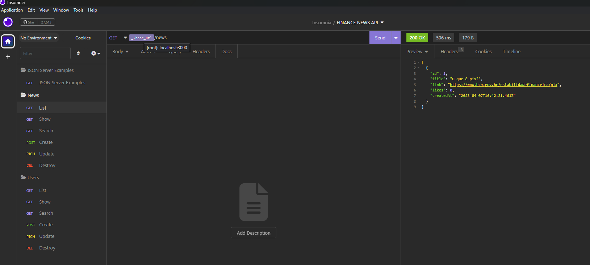

# FINANCE NEWS API COLLECTION
Foi adicionado o arquivo [FINANCE NEWS API COLLECTION](FINANCE_NEWS_API_COLLECTION.json) que contém a documentação da [API RESTFul](https://pt.wikipedia.org/wiki/REST).

Para utilizar, recomendamos a utilização do cliente gratuito [INSOMNIA](https://insomnia.rest/). Após fazer o download, siga as [instruções oficiais para importar a coleção](https://docs.insomnia.rest/insomnia/import-export-data).

Uma vez importado corretamente a coleção, você verá o seguinte:

Exemplos para todas as operações de CRUD e a operação SEARCH, foram adicionados para as duas entidades da API:

* News (notícias)
* Users (usuários)

Além disso, uma pasta com o link para a documentação oficial do [JSON-SERVER](https://github.com/typicode/json-server#filter) foi adicionada onde é possível consultar outras operações como slice, sort, filter etc.